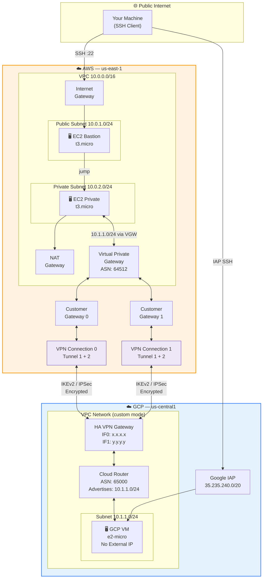

<div align="center">

# Multi-Cloud Architecture
## AWS ↔ GCP Secure Connectivity via HA VPN

[](https://terraform.io)
[](https://aws.amazon.com)
[](https://cloud.google.com)
[](../.github/workflows/terraform-ci.yml)
[](../../LICENSE)

*Enterprise-grade multi-cloud networking — provisioned in minutes with Terraform*

[Overview](#-overview) · [Architecture](#-architecture) · [Quickstart](#-quickstart) · [Testing](#-connectivity-testing) · [Roadmap](#-roadmap)

</div>

---

## 📌 Overview

This project demonstrates a **production-grade, highly available site-to-site VPN** connecting AWS and Google Cloud Platform — the kind of setup used by enterprises running workloads across multiple cloud providers.

**What it builds:**

| Layer | AWS | GCP |
|-------|-----|-----|
| Network | VPC `10.0.0.0/16` | VPC Network `10.1.0.0/16` |
| Compute | EC2 Bastion + Private Instance | Shielded VM (no external IP) |
| Routing | Virtual Private Gateway (BGP ASN 64512) | Cloud Router (BGP ASN 65000) |
| VPN | 2× VPN Connections (4 IPSec tunnels) | HA VPN Gateway (2 interfaces) |
| Access | Internet Gateway + NAT Gateway | Identity-Aware Proxy (IAP) |

**Key engineering decisions:**
- **BGP dynamic routing** — automatic failover with no manual route updates
- **4-tunnel HA** (`FOUR_IPS_REDUNDANCY`) — 99.99% uptime SLA on GCP HA VPN
- **Zero trust networking** — GCP VM has no external IP; accessed via IAP or VPN
- **IaC-first** — every resource is version-controlled and reproducible

---

## 🏗 Architecture



### VPN Tunnel Map

```
AWS VGW ──[Connection 0]──┬── Tunnel A (169.254.10.0/30) ──► GCP HA VPN IF0
                           └── Tunnel B (169.254.11.0/30) ──► GCP HA VPN IF0

AWS VGW ──[Connection 1]──┬── Tunnel C (169.254.12.0/30) ──► GCP HA VPN IF1
                           └── Tunnel D (169.254.13.0/30) ──► GCP HA VPN IF1

BGP Sessions: 4 (one per tunnel)
  AWS VGW (64512) ←── advertises 10.0.0.0/16 ──→ Cloud Router (65000)
  Cloud Router    ←── advertises 10.1.1.0/24 ──→ AWS VGW
```

---

## 📁 Project Structure

```
1-multi-cloud-architecture/
│
├── 📄 README.md                          ← You are here
│
├── 📂 terraform/
│   ├── versions.tf                       ← Terraform + provider version pins
│   ├── providers.tf                      ← AWS + GCP provider config
│   ├── main.tf                           ← Module orchestration
│   ├── variables.tf                      ← All inputs with validation
│   ├── outputs.tf                        ← Key outputs + test commands
│   ├── terraform.tfvars.example          ← Copy → terraform.tfvars
│   ├── .gitignore                        ← Excludes state & secrets
│   │
│   ├── 📂 aws/                           ── AWS Infrastructure Module ──
│   │   ├── main.tf                       ← VPC, EC2, IGW, NAT, VPN GW
│   │   ├── variables.tf
│   │   └── outputs.tf
│   │
│   ├── 📂 gcp/                           ── GCP Infrastructure Module ──
│   │   ├── main.tf                       ← VPC, VM, Firewall, Router, HA VPN
│   │   ├── variables.tf
│   │   └── outputs.tf
│   │
│   └── 📂 vpn/                           ── VPN Connectivity Module ──
│       ├── main.tf                       ← Customer GWs, Tunnels, BGP Peers
│       ├── variables.tf
│       └── outputs.tf
│
└── 📂 architecture-diagram/
    ├── multi-cloud-architecture.png      ← [Add your diagram here]
    └── architecture-description.md      ← Recreation guide (draw.io / Lucidchart)
```

---

## ⚡ Quickstart

### Prerequisites

<details>
<summary><b>1. Install required tools</b></summary>

```bash
# Terraform (macOS)
brew tap hashicorp/tap && brew install hashicorp/tap/terraform

# AWS CLI
brew install awscli

# gcloud CLI
brew install --cask google-cloud-sdk

# Verify versions
terraform --version  # >= 1.5.0
aws --version        # >= 2.0
gcloud --version
```
</details>

<details>
<summary><b>2. Configure AWS credentials</b></summary>

```bash
aws configure
# AWS Access Key ID:     [your key]
# AWS Secret Access Key: [your secret]
# Default region:        us-east-1
# Default output format: json

# Create an EC2 key pair for SSH
aws ec2 create-key-pair \
  --key-name multi-cloud-vpn-key \
  --query 'KeyMaterial' \
  --output text > ~/.ssh/multi-cloud-vpn-key.pem

chmod 400 ~/.ssh/multi-cloud-vpn-key.pem
```
</details>

<details>
<summary><b>3. Configure GCP credentials</b></summary>

```bash
# Application Default Credentials
gcloud auth application-default login

# Set your project
export GCP_PROJECT="your-gcp-project-id"
gcloud config set project $GCP_PROJECT

# Enable required APIs
gcloud services enable compute.googleapis.com iap.googleapis.com
```
</details>

---

### Deploy

```bash
# 1. Clone the repo
git clone https://github.com/YOUR_USERNAME/devops-portfolio.git
cd devops-portfolio/1-multi-cloud-architecture

# 2. Configure variables
cp terraform/terraform.tfvars.example terraform/terraform.tfvars
# Edit terraform.tfvars — fill in your GCP project ID, key name, PSKs, etc.

# 3. Initialize
make init

# 4. Preview changes (~35 resources)
make plan

# 5. Deploy (~10-15 min)
make apply
```

> [!NOTE]
> VPN tunnels can take 2–5 minutes to reach `UP` status after `apply` completes.

> [!IMPORTANT]
> Set `allowed_ssh_cidr = "$(curl -s ifconfig.me)/32"` in your tfvars — do not use `0.0.0.0/0` in production.

### Tear Down

```bash
make destroy
```

---

## 🧪 Connectivity Testing

### 1. Check VPN Tunnel Status

```bash
# All 4 tunnels should show Status: UP
make vpn-status
```

Expected output:
```
----------------------------------------------
| IP            | Status | Last Changed      |
----------------------------------------------
| 52.x.x.x      | UP     | 2024-01-15T10:23  |
| 52.x.x.x      | UP     | 2024-01-15T10:23  |
| 54.x.x.x      | UP     | 2024-01-15T10:24  |
| 54.x.x.x      | UP     | 2024-01-15T10:24  |
----------------------------------------------
```

### 2. SSH to AWS Bastion → Private EC2

```bash
BASTION=$(terraform -chdir=terraform output -raw aws_bastion_public_ip)
PRIVATE=$(terraform -chdir=terraform output -raw aws_private_instance_ip)

# Hop into bastion, then jump to private instance
ssh -J ec2-user@$BASTION \
    -i ~/.ssh/multi-cloud-vpn-key.pem \
    ec2-user@$PRIVATE
```

### 3. Ping GCP VM from AWS Private Instance

```bash
# From the AWS private instance:
GCP_VM_IP=$(terraform -chdir=terraform output -raw gcp_test_vm_internal_ip)

ping -c 4 $GCP_VM_IP
```

```
PING 10.1.1.x (10.1.1.x): 56 data bytes
64 bytes from 10.1.1.x: icmp_seq=0 ttl=62 time=24.7 ms
64 bytes from 10.1.1.x: icmp_seq=1 ttl=62 time=25.1 ms
64 bytes from 10.1.1.x: icmp_seq=2 ttl=62 time=24.9 ms
64 bytes from 10.1.1.x: icmp_seq=3 ttl=62 time=25.2 ms

--- 10.1.1.x ping statistics ---
4 packets transmitted, 4 received, 0% packet loss, time 3005ms
```

### 4. SSH to GCP VM via IAP (no external IP needed)

```bash
GCP_VM=$(terraform -chdir=terraform output -raw gcp_test_vm_name)

gcloud compute ssh $GCP_VM \
  --zone=us-central1-a \
  --project=$GCP_PROJECT \
  --tunnel-through-iap
```

### 5. Verify BGP Route Propagation

```bash
# Check AWS route table — should show 10.1.1.0/24 via VGW
aws ec2 describe-route-tables \
  --filters "Name=tag:Name,Values=*private-rt*" \
  --query 'RouteTables[*].Routes[?Origin==`EnableVgwRoutePropagation`].[DestinationCidrBlock,State]' \
  --output table
```

```
+------------------+---------+
| 10.1.1.0/24      | active  |   ← GCP subnet learned via BGP
+------------------+---------+
```

---

## 💰 Cost Estimate

> Approximate monthly cost running 24/7 in us-east-1 / us-central1.

| Resource | Service | Est. Cost/mo |
|----------|---------|-------------|
| 2× AWS VPN Connections | AWS Site-to-Site VPN | $72.00 |
| AWS NAT Gateway | AWS NAT | $32.40 |
| 2× EC2 t3.micro | AWS EC2 | $16.80 |
| AWS Elastic IP | AWS EC2 | $3.60 |
| GCP HA VPN (4 tunnels) | GCP Cloud VPN | $73.00 |
| GCP e2-micro VM | GCP Compute | $6.00 |
| Data transfer (est.) | Cross-cloud egress | ~$10.00 |
| **Total** | | **~$214/mo** |

> [!TIP]
> Run `make destroy` when not demoing. The main cost drivers are VPN connections ($72 AWS + $73 GCP) which charge hourly.

---

## 🔧 Available Make Commands

```bash
make help          # Show all commands
make init          # terraform init
make plan          # terraform plan
make apply         # terraform apply
make destroy       # terraform destroy
make fmt           # auto-format .tf files
make validate      # terraform validate
make lint          # tflint
make security-scan # tfsec
make vpn-status    # check AWS tunnel status
make show-ips      # print key IPs
make clean         # remove .terraform/, tfplan
```

---

## 🛠 Tools & Technologies

| Tool | Purpose |
|------|---------|
| [Terraform](https://terraform.io) `>= 1.5` | Infrastructure as Code |
| [AWS Provider](https://registry.terraform.io/providers/hashicorp/aws/latest) `~> 5.0` | AWS resource management |
| [GCP Provider](https://registry.terraform.io/providers/hashicorp/google/latest) `~> 5.0` | GCP resource management |
| [tflint](https://github.com/terraform-linters/tflint) | Terraform linter |
| [tfsec](https://github.com/aquasecurity/tfsec) | IaC security scanner |
| [pre-commit](https://pre-commit.com) | Git hook framework |
| [GitHub Actions](https://docs.github.com/en/actions) | CI/CD pipeline |
| AWS HA VPN | Site-to-site IPSec VPN |
| GCP HA VPN | High-availability VPN gateway |
| BGP (IKEv2) | Dynamic route exchange |

---

## 🚀 Roadmap

| Feature | Description | Status |
|---------|-------------|--------|
| S3 Remote State | Migrate to S3 + DynamoDB backend | Planned |
| Private DNS | Route53 ↔ Cloud DNS private zone peering | Planned |
| Monitoring | CloudWatch + Cloud Monitoring tunnel health dashboards | Planned |
| AWS Transit Gateway | Multi-VPC hub-and-spoke topology | Future |
| Network Firewall | AWS Network Firewall + GCP Cloud Armor | Future |
| Terraform Cloud | CI/CD with Sentinel policy enforcement | Future |
| Multi-Region | Second AWS + GCP region for geo-redundancy | Future |

---

## 🔐 Security Notes

- **Secrets**: VPN PSKs are marked `sensitive = true` and never appear in Terraform output
- **State files**: Never commit `terraform.tfstate` — use S3 remote backend with encryption
- **SSH**: Bastion restricted to `allowed_ssh_cidr` — use your IP (`curl ifconfig.me`)
- **GCP VM**: No external IP — only reachable via IAP or over VPN tunnel
- **IAP**: GCP Identity-Aware Proxy provides SSH access without exposing port 22 publicly

---

<div align="center">

*Part of the [DevOps Portfolio](../README.md) project series*

</div>
