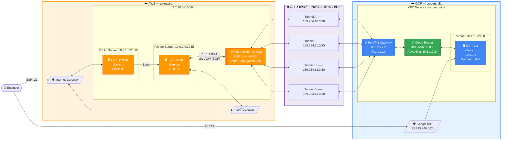

# Multi-Cloud Architecture Diagram
## AWS ↔ GCP Secure Connectivity via HA VPN

---

## Mermaid Diagram *(renders natively on GitHub)*



---

## Full ASCII Architecture Diagram

```
╔══════════════════════════════════════════════════════════════════════════════════════════════╗
║           MULTI-CLOUD ARCHITECTURE  —  AWS ↔ GCP SECURE CONNECTIVITY VIA HA VPN             ║
╚══════════════════════════════════════════════════════════════════════════════════════════════╝

                              ┌──────────────────────┐
                              │    🌐  INTERNET        │
                              └──────────┬─────────────┘
                                         │ SSH :22
                           ┌─────────────▼──────────────┐
                           │  👤  You / DevOps Engineer  │
                           └──────────┬──────────────────┘
                                      │                  IAP SSH (35.235.240.0/20)
          ────────────────────────────┼────────────────────────────────────────────────
                                      │
   ╔══ AWS Cloud  (us-east-1) ════════▼══════════════════════╗
   ║                                                         ║
   ║   ┌── VPC  10.0.0.0/16 ─────────────────────────────┐  ║
   ║   │                                                  │  ║
   ║   │   [Internet Gateway]                             │  ║
   ║   │          │ ▲                                     │  ║
   ║   │          │ │ Public traffic                      │  ║
   ║   │   ┌──────▼─┴──────────────────┐                  │  ║
   ║   │   │  Public Subnet            │                  │  ║
   ║   │   │  10.0.1.0/24              │                  │  ║
   ║   │   │                           │                  │  ║
   ║   │   │  ┌─────────────────────┐  │                  │  ║
   ║   │   │  │  EC2 Bastion Host   │  │  [NAT Gateway]   │  ║
   ║   │   │  │  AMI: AL2023        │  │  (outbound for   │  ║
   ║   │   │  │  Type: t3.micro     │  │  private subnet) │  ║
   ║   │   │  │  Public IP: ✓       │  │                  │  ║
   ║   │   │  │  SG: SSH/22 only    │  │                  │  ║
   ║   │   │  └──────────┬──────────┘  │                  │  ║
   ║   │   └─────────────┼─────────────┘                  │  ║
   ║   │                 │ SSH jump                        │  ║
   ║   │   ┌─────────────▼─────────────┐                  │  ║
   ║   │   │  Private Subnet           │                  │  ║
   ║   │   │  10.0.2.0/24              │                  │  ║
   ║   │   │                           │                  │  ║
   ║   │   │  ┌─────────────────────┐  │                  │  ║
   ║   │   │  │  EC2 Private Test   │  │                  │  ║
   ║   │   │  │  AMI: AL2023        │  │                  │  ║
   ║   │   │  │  Type: t3.micro     │  │                  │  ║
   ║   │   │  │  IP: 10.0.2.x       │  │                  │  ║
   ║   │   │  │  No Public IP       │  │                  │  ║
   ║   │   │  └──────────┬──────────┘  │                  │  ║
   ║   │   └─────────────┼─────────────┘                  │  ║
   ║   │                 │ BGP route 10.1.1.0/24           │  ║
   ║   │   ┌─────────────▼──────────────────────────────┐ │  ║
   ║   │   │  Virtual Private Gateway (VGW)             │ │  ║
   ║   │   │  BGP ASN: 64512                            │ │  ║
   ║   │   │  Route Propagation → Private RT: ✓         │ │  ║
   ║   │   └──────┬────────────────────────┬────────────┘ │  ║
   ║   └──────────┼────────────────────────┼──────────────┘  ║
   ║              │                        │                  ║
   ║   [CGW-0: GCP IF0]          [CGW-1: GCP IF1]            ║
   ║   BGP ASN: 65000             BGP ASN: 65000              ║
   ║              │                        │                  ║
   ║   [VPN Connection 0]        [VPN Connection 1]           ║
   ║   Tunnel 1 + 2               Tunnel 1 + 2                ║
   ╚══════════════╪════════════════════════╪══════════════════╝
                  │                        │
        ╔═════════╪════════════════════════╪═════════════╗
        ║         │  🔒 4× HA IPSec Tunnels │             ║
        ║         │     IKEv2 / AES-256     │             ║
        ║   ┌─────▼─────────────────────────▼──────┐     ║
        ║   │  Tunnel A  ←→  169.254.10.0/30  🔐   │     ║
        ║   │  Tunnel B  ←→  169.254.11.0/30  🔐   │     ║
        ║   │  Tunnel C  ←→  169.254.12.0/30  🔐   │     ║
        ║   │  Tunnel D  ←→  169.254.13.0/30  🔐   │     ║
        ║   └──────────────────────────────────────┘     ║
        ║                                                 ║
        ║   BGP Dynamic Routing:                          ║
        ║     AWS 64512  ──advertises── 10.0.0.0/16 →     ║
        ║     GCP 65000  ──advertises── 10.1.1.0/24 →     ║
        ║                                                 ║
        ║   Redundancy: FOUR_IPS_REDUNDANCY               ║
        ║   SLA: 99.99% uptime                            ║
        ╚═════════╪════════════════════════╪═════════════╝
                  │                        │
   ╔══ GCP  (us-central1) ════════════════╪═══════════╗
   ║              │                        │           ║
   ║   ┌──────────▼────────────────────────▼────────┐ ║
   ║   │  HA VPN Gateway                            │ ║
   ║   │  Interface 0 (IF0): x.x.x.x  ← Conn-0     │ ║
   ║   │  Interface 1 (IF1): y.y.y.y  ← Conn-1     │ ║
   ║   └────────────────────┬───────────────────────┘ ║
   ║                        │ BGP sessions (×4)        ║
   ║   ┌────────────────────▼───────────────────────┐ ║
   ║   │  Cloud Router                              │ ║
   ║   │  BGP ASN: 65000                            │ ║
   ║   │  Advertises: 10.1.1.0/24 to AWS            │ ║
   ║   │  Learns: 10.0.0.0/16 from AWS              │ ║
   ║   └────────────────────┬───────────────────────┘ ║
   ║                        │                          ║
   ║   ┌── VPC Network (custom mode) ───────────────┐ ║
   ║   │                    │                        │ ║
   ║   │   ┌────────────────▼──────────────────┐    │ ║
   ║   │   │  Subnet  10.1.1.0/24              │    │ ║
   ║   │   │                                   │    │ ║
   ║   │   │  ┌───────────────────────────┐    │    │ ║
   ║   │   │  │  GCP Test VM              │    │    │ ║
   ║   │   │  │  Image: Debian 12         │ ◄──┼────┼─╫── IAP SSH
   ║   │   │  │  Type: e2-micro           │    │    │ ║   (35.235.240.0/20)
   ║   │   │  │  IP: 10.1.1.x             │    │    │ ║
   ║   │   │  │  No External IP  🛡        │    │    │ ║
   ║   │   │  │  Shielded VM: ON          │    │    │ ║
   ║   │   │  └───────────────────────────┘    │    │ ║
   ║   │   └───────────────────────────────────┘    │ ║
   ║   │                                            │ ║
   ║   │   Firewall Rules:                          │ ║
   ║   │   ✅ Allow SSH via IAP (35.235.240.0/20)   │ ║
   ║   │   ✅ Allow ICMP from AWS (10.0.0.0/16)     │ ║
   ║   │   ✅ Allow SSH from AWS  (10.0.0.0/16)     │ ║
   ║   │   ✅ Allow Internal      (10.1.1.0/24)     │ ║
   ║   └────────────────────────────────────────────┘ ║
   ╚════════════════════════════════════════════════════╝

   Route Table Summary:
   ┌──────────────────┬──────────────────────┬─────────────────────────────────┐
   │ Table            │ Destination          │ Target                          │
   ├──────────────────┼──────────────────────┼─────────────────────────────────┤
   │ AWS Public RT    │ 0.0.0.0/0            │ Internet Gateway                │
   │ AWS Private RT   │ 0.0.0.0/0            │ NAT Gateway                     │
   │ AWS Private RT   │ 10.1.1.0/24          │ VPN Gateway (BGP propagated)    │
   │ GCP Cloud Router │ 10.0.0.0/16          │ Learned from AWS via BGP        │
   │ GCP Cloud Router │ 10.1.1.0/24          │ Advertised to AWS via BGP       │
   └──────────────────┴──────────────────────┴─────────────────────────────────┘
```

---

## Terraform Resource Map

```
terraform/
├── versions.tf          → terraform {} + required_providers
├── providers.tf         → aws {} + google {} config
├── variables.tf         → all input variables
├── outputs.tf           → key outputs + test commands
│
├── aws/main.tf
│     aws_vpc                          → VPC 10.0.0.0/16
│     aws_internet_gateway             → Internet Gateway
│     aws_subnet (public)             → 10.0.1.0/24
│     aws_subnet (private)            → 10.0.2.0/24
│     aws_eip + aws_nat_gateway       → NAT for private subnet
│     aws_route_table (public)        → 0.0.0.0/0 → IGW
│     aws_route_table (private)       → 0.0.0.0/0 → NAT
│     aws_vpn_gateway                 → VGW ASN 64512
│     aws_vpn_gateway_route_propagation → auto-propagate VPN routes
│     aws_security_group (bastion)    → SSH from allowed CIDR
│     aws_security_group (private)    → SSH from bastion + ICMP from GCP
│     aws_instance (bastion)         → AL2023, t3.micro, public subnet
│     aws_instance (private)         → AL2023, t3.micro, private subnet
│
├── gcp/main.tf
│     google_compute_network          → VPC (custom, no auto subnets)
│     google_compute_subnetwork       → 10.1.1.0/24 + flow logs
│     google_compute_firewall ×4      → IAP, ICMP, SSH-from-AWS, internal
│     google_compute_router           → Cloud Router ASN 65000
│     google_compute_ha_vpn_gateway   → HA VPN IF0 + IF1
│     google_compute_instance         → Debian 12, e2-micro, shielded, no ext IP
│
└── vpn/main.tf
      aws_customer_gateway ×2         → CGW-0 → GCP IF0, CGW-1 → GCP IF1
      aws_vpn_connection ×2           → Conn-0 (Tunnels A+B), Conn-1 (Tunnels C+D)
      google_compute_external_vpn_gateway → FOUR_IPS_REDUNDANCY (4 AWS IPs)
      google_compute_vpn_tunnel ×4    → Tunnels A, B, C, D
      google_compute_router_interface ×4  → GCP BGP IPs (cgw_inside_address)
      google_compute_router_peer ×4   → AWS BGP IPs (vgw_inside_address)
```

---

## BGP Session Detail

```
  AWS Tunnel Endpoint             BGP Inside CIDRs         GCP Router Interface
  ───────────────────────────────────────────────────────────────────────────────
  VPN Conn-0 / Tunnel 1      ←→  169.254.10.0/30    ←→  Cloud Router (RI-A)
    VGW inside: 169.254.10.1                              peer: 169.254.10.1
    CGW inside: 169.254.10.2                              ip:   169.254.10.2/30

  VPN Conn-0 / Tunnel 2      ←→  169.254.11.0/30    ←→  Cloud Router (RI-B)
    VGW inside: 169.254.11.1                              peer: 169.254.11.1
    CGW inside: 169.254.11.2                              ip:   169.254.11.2/30

  VPN Conn-1 / Tunnel 1      ←→  169.254.12.0/30    ←→  Cloud Router (RI-C)
    VGW inside: 169.254.12.1                              peer: 169.254.12.1
    CGW inside: 169.254.12.2                              ip:   169.254.12.2/30

  VPN Conn-1 / Tunnel 2      ←→  169.254.13.0/30    ←→  Cloud Router (RI-D)
    VGW inside: 169.254.13.1                              peer: 169.254.13.1
    CGW inside: 169.254.13.2                              ip:   169.254.13.2/30

  Priority: Tunnels A+B → 100 (preferred)   Tunnels C+D → 200 (failover)
```

---

## Legend

```
  ══════  AWS Cloud boundary
  ══════  GCP Cloud boundary
  ──────  Network traffic path
  🔐     Encrypted IPSec tunnel
  🔑     VPN / gateway resource
  🛡     Security / access control
  ✅     Allowed firewall rule
  🖥     Compute instance
```

---

## Export This Diagram as PNG

To create `multi-cloud-architecture.png` for the README screenshot:

1. Open [draw.io](https://app.diagrams.net)
2. Use **Extras → Edit Diagram** and paste the ASCII layout above as a reference
3. Add AWS + GCP shape libraries: **Search Shapes → "AWS" / "GCP"**
4. Use the color palette below:

| Element | Color |
|---------|-------|
| AWS region box | `#FFF3E0` border `#FF9900` |
| GCP region box | `#E3F2FD` border `#4285F4` |
| VPN tunnels | `#EDE7F6` border `#673AB7` |
| EC2 / VMs | `#FF9900` (AWS) `#4285F4` (GCP) |
| Cloud Router | `#34A853` |
| Arrows | `#212121` with arrowheads |

5. Export as PNG (`File → Export As → PNG`, 2× resolution)
6. Save as `multi-cloud-architecture.png` in this directory
